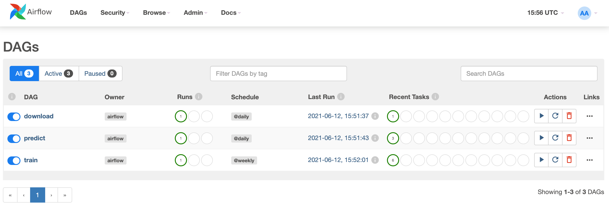
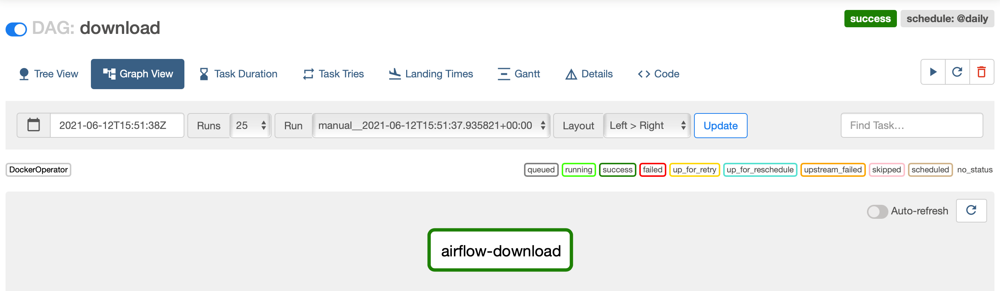
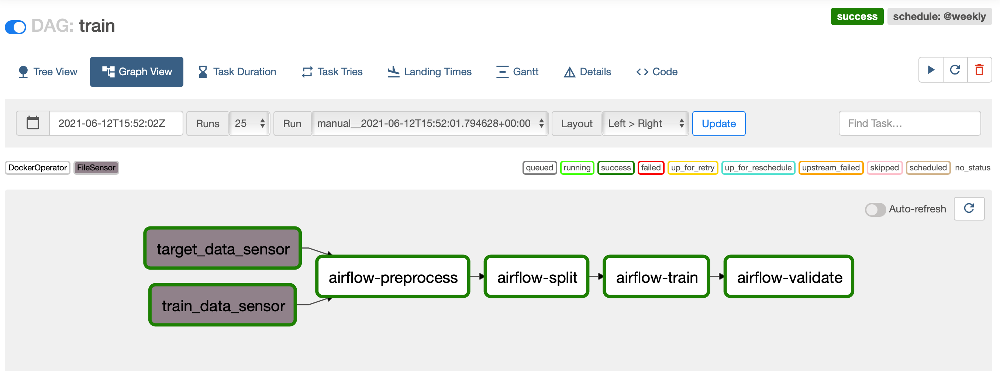
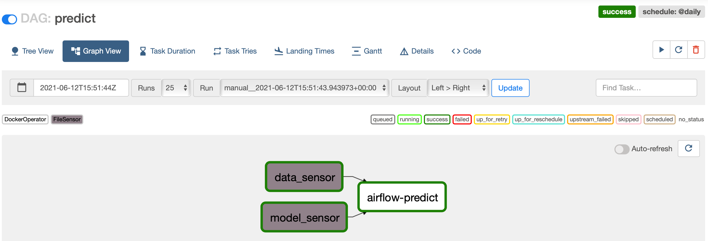
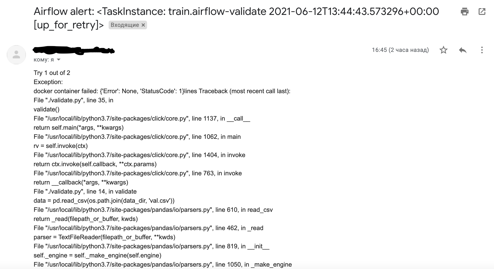

## Машинное обучение в продакшене
### Домашнее задание №3 

Автор: [viconstel](https://data.mail.ru/profile/k.elizarov/)

Перейдите в директорию домашнего задания:
 ```
 cd airflow_ml_dags/
```
Сборка образов и запуск Airflow:
```
docker-compose up --build
```
Запуск тестов:
```
sh env.sh && pytest -v tests/test_dags.py
```
Скриншоты:
1. Список всех дагов

2. Даг download

3. Даг train

4. Даг predict

5. E-mail с failure alert


### Самооценка
```
0. Сделано
1. Сделано +5 баллов
2. Сделано +10 баллов
3. Сделано +5 баллов
3а. Сделано +3 балла
4. Сделано (все даги реализованы только с DockerOperator) +10 баллов
5. Сделано +5 баллов
6. Не сделано
7. Не сделано
8. Сделано +3 балла
9. Сделано +1 балл

Сумма: 42 балла
```