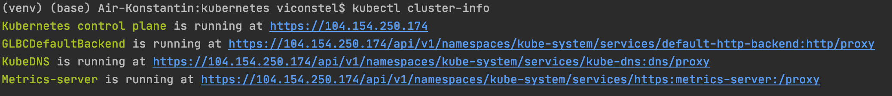
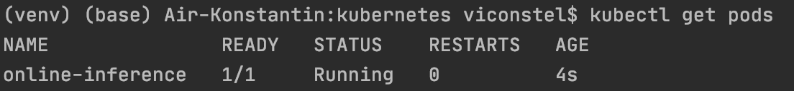
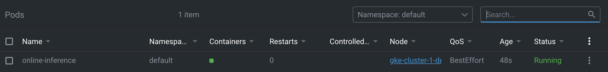
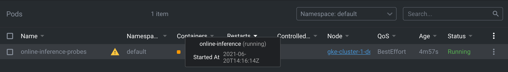
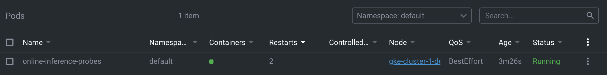
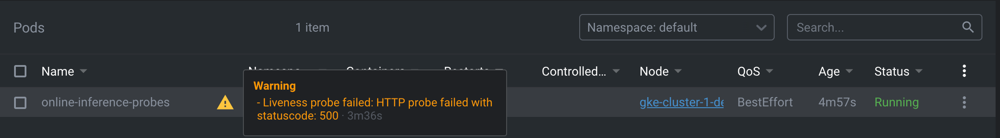

## Машинное обучение в продакшене
### Домашнее задание №4 

Автор: [viconstel](https://data.mail.ru/profile/k.elizarov/)

Директория домашнего задания - `kubernetes/`<br>
В директории `kubernetes_manifests/` находятся 
манифесты Kubernetes, которые необходимы в рамках
данного домашнего задания. <br>

Порядок выполнения:
0. Установил `kubectl` и `Lens`.
1. Развернул kubernetes кластер в Google Cloud Platform:
https://cloud.google.com/kubernetes-engine

2. Задеплоил простой pod (online-inference-pod.yaml)


3. Прописал requests/limits (online-inference-pod-resources.yaml)
Это необходимо, чтобы планировщик мог корректно распределять
нагрузку между нодами. Если ресурсы не ограничены, pod может
занять все ресурсы ноды, тогда при превышении лимитов на ресурсы
pod может быть перезапущен или принудительно ограничен в
потреблении ресурсов. Приложениям с прописанными реквестами и лимитами
дается большая гарантия быть развернутыми, в отличие от
приложений без прописанных ограничений, которые могут быть 
не задеплоены в экстренных случаях. 
4. Изменил код приложения так, чтобы оно стартовало и падало
через определенные промежутки времени. 
Новый образ `viconstel/online_inference:v2` загружен на DockerHub.
Добавил readiness и liveness пробы (online-inference-pod-probes.yaml).
Теперь kubernetes ждет, пока загрузится модель, о чем будет
свидетельствовать положительная ReadinessProbe. 
LivenessProbe проверяет живо ли приложение и в случае
отрицательной пробы перезапускает pod. 



5. Создал ReplicaSet с 3 репликами (online-inference-replicaset.yaml).
Если сменить докер образ в манифесте и одновременно с
этим уменьшить число реплик, то количество реплик будет
доведено до нужного значения, однако смены версии образа не произойдет.
Если сменить докер образ в манифесте и одновременно с
этим увеличить число реплик, то имеющиеся реплики будут основаны
на старой версии образа, а добавленные до нужного
количества реплики будут основаны на новой версии образа.
6. Сделал Deployment приложения.
При выставлении параметров `maxSurge: 100%` и `maxUnavailable: 0%`
(online-inference-deployment-blue-green.yaml)
на кластере будет момент времени, когда
добавится 100% новых подов и не будут удалены старые. Такой
формат предпочтительнее для безопасной выкатки новой
версии, чтобы сохранить нужное количество инстансов для
непрерывной работы приложения.
При выставлении параметров `maxSurge: 0%` и `maxUnavailable: 100%`
(online-inference-deployment-rolling-update.yaml) во 
время поднятия новых сущеностей будут погашены все старые.


### Самооценка
```
0. Сделано
1. Сделано +5 баллов
2. Сделано +4 балла
2а. Сделано +2 балла
3. Сделано +3 балла
4. Сделано +3 балла
5. Сделано +3 балла

Сумма: 20 баллов
```